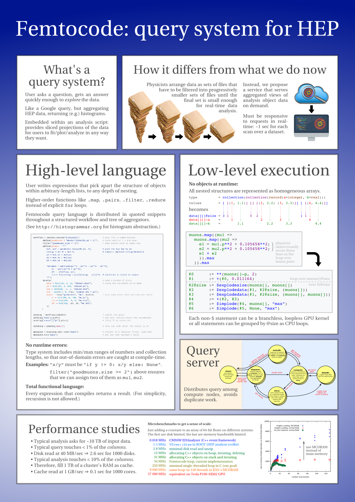

# HEPQuery

HEPQuery is a project to provide a fast, query-engine style interface to High Energy Physics (HEP) data. It's related to

   * [Femtocode](https://github.com/diana-hep/femtocode) query language`*`
   * [PLUR](https://github.com/diana-hep/plur) data representation

(`*`The Femtocode project is on hold while we develop the data representation and use [Numba-compiled Python](http://numba.pydata.org/) as a query language. Data representation should be independent of language for modularity.
Here is an old poster describing the motivation and feasibility studies.



# Demo

Although it's in the early stages of development, you can check out and run some examples of HEPQuery. First get the dependencies:

   * [Revision 203 of PLUR](https://github.com/diana-hep/plur/releases/tag/rev203); install with `python setup.py install --user`
   * [Numba](https://numba.pydata.org/#installing); e.g. from [Conda](https://conda.io/miniconda.html).
   * [ROOT with BulkAPI](https://github.com/jpivarski/root/tree/root-bulkapi-fastread-v2); `git clone https://github.com/jpivarski/root.git -b root-bulkapi-fastread-v2` and [compile ROOT](https://root.cern.ch/building-root). This is for a ROOT → Numpy feature that is scheduled for ROOT version 6.12 (this winter).
   * **Not** Femtocode; it is not necessary.

Finally, git-clone Revision XYZ of HEPQuery and install it with `python setup.py install --user`.

Import two features:

```python
from hepquery.backends.root import ROOTDataset
from hepquery.cache import Cache
```

for loading data from ROOT and representing them as PLUR for calculations, optionally caching the PLUR for faster iteration.

Next, create a 100 GB cache on some fast disk (SSD):

```python
cache = Cache.adopt("/mnt/cache", 100*1024**3)
```

and point to the ROOT data, backed by the cache:

```python
dataset = ROOTDataset.fromfiles("Events", "/mnt/data/DYJetsToLL*/*.root", cache=cache)
```

Create a "query" by defining a function to be executed on the data. The interface is a little rough right now; you have to write the function to be executed separately on each TTree in your sample. In the future, a suite of high-level functionals (map, filter, reduce) will be provided. (But this _does_ demonstrate that random access is possible and efficient.)

```python
histogram = numpy.zeros(100, dtype=numpy.int32)

def fcn(tree, histogram):
    for event in tree:
        for muon in event.Muon:        # just fill a histogram of muon.pt
            bin = int(muon.pt)
            if bin >= 0 and bin < 100:
                histogram[bin] += 1
```

All mutable data must be passed in as an explicit argument, such as `histogram` here.

Run it in debug mode to see how the code gets transformed and to measure the rate of access/computation.

```
>>> dataset.foreachtree(fcn, histogram, numba=True, debug=True)

BEFORE:

def fcn(tree, histogram):
    for event in tree:
        for muon in event.Muon:
            bin = int(muon.pt)
            if ((bin >= 0) and (bin < 100)):
                histogram[bin] += 1

    return None 

AFTER:

def fcn(array_0, array_1, array_2, histogram):
    for event in range(array_0[1]):
        for muon in range(array_1[event], array_1[(event + 1)]):
            bin = int(array_2[muon])
            if ((bin >= 0) and (bin < 100)):
                histogram[bin] += 1

    return None 

array_0 -->     Events-Lo (None)
array_1 -->     Events-Ld-R_Muon-Lo (Muon)
array_2 -->     Events-Ld-R_Muon-Ld-R_pt (Muon.pt)

  2% done; reading: 40.328 MB/s, computing: 105.775 MHz (...HT_100to200_13TeV_2_0.root)
  3% done; reading: 195.188 MB/s, computing: 104.218 MHz (...HT_100to200_13TeV_2_1.root)
  5% done; reading: 220.695 MB/s, computing: 106.389 MHz (...T_100to200_13TeV_2_10.root)
  7% done; reading: 219.343 MB/s, computing: 106.408 MHz (...T_100to200_13TeV_2_11.root)
  ...
 97% done; reading: 262.094 MB/s, computing: 66.308 MHz (...HT_600toInf_13TeV_2_7.root)
 98% done; reading: 337.129 MB/s, computing: 67.579 MHz (...HT_600toInf_13TeV_2_8.root)
100% done; reading: 232.974 MB/s, computing: 67.133 MHz (...HT_600toInf_13TeV_2_9.root)
========================================================================================
total time spent compiling: 0.353 sec
             opening files: 0.078 sec
              reading data: 0.238 sec (46.302 MB --> 194.745 MB/s)
                 computing: 0.061 sec (5389283 entries --> 87.645 MHz)

      from start to finish: 0.734 sec
```

For a fast SSD disk (top speed of 370 MB/s), you can expect rates like

|   | cold files on disk  | files paged to RAM by OS |
|:-:|:-------------------:|:------------------------:|
| first read (from ROOT)  |  45 MB/s |  320 MB/s |
| subsequent (from cache) | 185 MB/s | 1100 MB/s |

If you turned on the cache, you'll find Numpy arrays in `/mnt/cache`. These are uncompressed and faster to load than ROOT branches, though the new BulkAPI feature is itself an order of magnitude faster than `TTree::Draw` (from files paged to RAM by OS).


